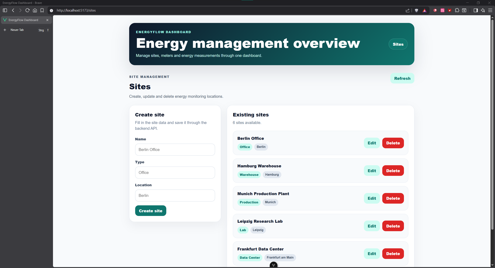

# EnergyFlow Dashboard


**EnergyFlow Dashboard** ist eine serviceorientierte Full-Stack-Webanwendung zur Erfassung, Verwaltung, Analyse und Visualisierung von Energieverbrauchsdaten.

Das Projekt zeigt den Aufbau einer modernen Webanwendung mit Vue-Frontend, Spring-Boot-Backend, REST-API und PostgreSQL-Datenbank. Der fachliche Fokus liegt auf Energiemanagement, Standortverwaltung, Energiezählern, Messwerten, Grenzwerten und einfachen Dashboard-Auswertungen.

---

## Inhaltsverzeichnis

* [Projektziel](#projektziel)
* [Aktueller Status](#aktueller-status)
* [Screenshots](#Screenshots)
* [Features](#features)
* [Tech-Stack](#tech-stack)
* [Architektur](#architektur)
* [Lokaler Start](#lokaler-start)
* [API-Beispiele](#api-beispiele)
* [Tests](#tests)
* [Dokumentation](#dokumentation)
* [Roadmap](#roadmap)
* [Autor](#autor)
* [License](#License)

---

## Projektziel

Ziel des Projekts ist eine Webanwendung, mit der Energieverbrauchsdaten verschiedener Standorte und Energiezähler verwaltet, ausgewertet und visualisiert werden können.

Die Anwendung soll zeigen, wie Frontend, Backend und Datenbank in einer serviceorientierten Architektur zusammenspielen. Zusätzlich werden fachliche Logiken wie Grenzwertprüfung, Warnstatus und Dashboard-Kennzahlen umgesetzt.

---

## Aktueller Status

Das Projekt befindet sich in Entwicklung.

### Bereits umgesetzt

* Vue-Frontend initialisiert
* Spring-Boot-Backend initialisiert
* PostgreSQL über Docker Compose eingerichtet
* Backend mit PostgreSQL verbunden
* Erste REST-API für Standorte umgesetzt
* Site CRUD API getestet

### Aktuell verfügbare API

```text
GET     /api/sites
GET     /api/sites/{id}
POST    /api/sites
PUT     /api/sites/{id}
DELETE  /api/sites/{id}
```

### Geplant

* Energiezähler-API
* Messwerte-API
* Grenzwertlogik
* Dashboard-Endpunkte
* Frontend-Anbindung an die REST-API
* Backend-Tests

---

## Screenshots

### Site Management



Die Site-Management-Ansicht zeigt das Vue-Frontend mit angebundener Spring-Boot-REST-API. Standorte können erstellt, angezeigt, bearbeitet und gelöscht werden.


---

## Features

### Standortverwaltung

* Standorte anzeigen
* Standort nach ID abrufen
* Standort anlegen
* Standort bearbeiten
* Standort löschen

### Geplante Funktionen

* Energiezähler verwalten
* Messwerte erfassen und filtern
* Grenzwerte definieren
* Warnstatus automatisch setzen
* Dashboard-Kennzahlen berechnen
* Verbrauchsdaten visualisieren

---

## Tech-Stack

### Frontend

* Vue 3
* TypeScript
* Vue Router
* Axios
* Chart.js

### Backend

* Java 21
* Spring Boot
* Spring Web
* Spring Data JPA
* Hibernate
* Maven
* Bean Validation
* REST-API
* DTOs

### Datenbank

* PostgreSQL 16

### Tools

* Git
* Docker
* Docker Compose
* Postman
* PowerShell
* VS Code

### Tests

* JUnit
* Mockito
* Spring Boot Test

---

## Architektur

```text
Frontend: Vue + TypeScript
|
v
REST-API
|
v
Backend: Java Spring Boot
|
|--- Controller Layer
|--- Service Layer
|--- Repository Layer
|--- Entity Layer
|--- DTO Layer
|--- Validation Layer
|--- Exception Handling
|
v
Database: PostgreSQL
```

Details zur Architektur stehen in:

```text
docs/architecture.md
```

---

## Lokaler Start

### Voraussetzungen

* Java 21
* Node.js
* npm
* Docker
* Docker Compose

### 1. Repository klonen

```bash
git clone https://github.com/USERNAME/EnergyFlow-Dashboard.git
cd EnergyFlow-Dashboard
```

### 2. PostgreSQL starten

```powershell
docker compose up -d
```

Prüfen:

```powershell
docker ps
```

Erwarteter Container:

```text
energyflow-postgres
```

### 3. Backend starten

```powershell
cd backend
.\mvnw.cmd spring-boot:run
```

Backend läuft unter:

```text
http://localhost:8080
```

### 4. Frontend starten

In einem zweiten Terminal:

```powershell
cd frontend
npm install
npm run dev
```

Frontend läuft unter:

```text
http://localhost:5173
```

Detaillierte Setup-Anleitung:

```text
docs/setup.md
```

---

## API-Beispiele

### Alle Standorte abrufen

```powershell
Invoke-RestMethod -Uri "http://localhost:8080/api/sites"
```

### Standort anlegen

```powershell
$body = @{
    name = "Verwaltungsgebaeude Ilmenau"
    type = "OFFICE"
    location = "Ilmenau"
} | ConvertTo-Json

Invoke-RestMethod `
    -Method POST `
    -Uri "http://localhost:8080/api/sites" `
    -ContentType "application/json" `
    -Body $body
```

### Standort nach ID abrufen

```powershell
Invoke-RestMethod -Uri "http://localhost:8080/api/sites/1"
```

Weitere API-Dokumentation:

```text
docs/api.md
```

---

## Tests

### Backend-Tests starten

```powershell
cd backend
.\mvnw.cmd test
```

### Frontend prüfen

```powershell
cd frontend
npm run lint
npm run build
```

---

## Dokumentation

Weitere Projektdokumentation:

```text
docs/
|
|--- architecture.md     // Architektur, Backend- und Frontend-Struktur
|--- api.md              // REST-Endpunkte und API-Testbeispiele
|--- database.md         // Datenbankmodell und Beziehungen
|--- setup.md            // lokale Installation und Startanleitung
|--- screenshots/        // geplante Screenshots
```

---

## Roadmap

### Version 1: MVP

* Site CRUD API
* Meter CRUD API
* Measurement CRUD API
* PostgreSQL-Datenbankmodell
* einfache Grenzwertlogik
* Dashboard-Kennzahlen
* Frontend-Ansichten für Standorte und Messwerte
* Backend-Unit-Tests

### Version 2: Professionalisierung

* Pagination und Sortierung
* Swagger/OpenAPI-Dokumentation
* globale Fehlerbehandlung
* Datenbankmigrationen mit Flyway oder Liquibase
* vollständiges Docker Compose für Frontend, Backend und Datenbank

### Version 3: Erweiterungen

* CSV-Upload für Messwerte
* CSV-Export
* PDF-Export für Dashboard-Berichte
* Benachrichtigungen bei kritischen Messwerten
* optionaler Go-Service für Import- oder Hintergrundverarbeitung

---

## Autor

Mohammad Taiba

---

## License

Copyright (c) 2026 Mohammad Taiba. All rights reserved.

This project is published for portfolio and review purposes only. See [LICENSE](./LICENSE).
