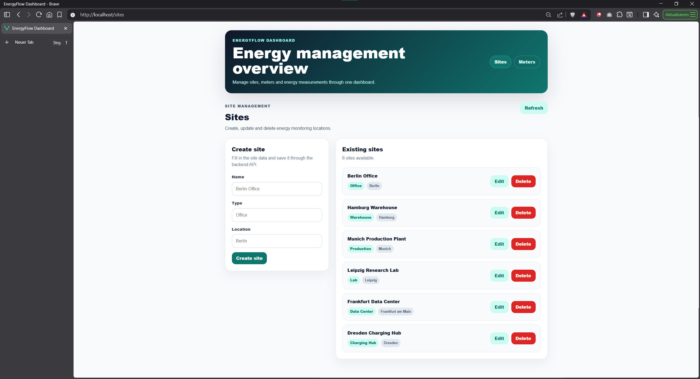

# EnergyFlow Dashboard


**EnergyFlow Dashboard** ist eine serviceorientierte Full-Stack-Webanwendung zur Erfassung, Verwaltung, Analyse und Visualisierung von Energieverbrauchsdaten.

Das Projekt zeigt den Aufbau einer modernen Webanwendung mit Vue-Frontend, Spring-Boot-Backend, REST-API und PostgreSQL-Datenbank. Der fachliche Fokus liegt auf Energiemanagement, Standortverwaltung, Energiezählern, Messwerten, Grenzwerten und einfachen Dashboard-Auswertungen.

---

## Inhaltsverzeichnis

* [Projektziel](#projektziel)
* [Aktueller Status](#aktueller-status)
* [Screenshots](#Screenshots)
* [Features](#features)
* [Tech-Stack](#tech-stack)
* [Architektur](#architektur)
* [Lokaler Start](#lokaler-start)
* [API-Beispiele](#api-beispiele)
* [Tests](#tests)
* [Dokumentation](#dokumentation)
* [Roadmap](#roadmap)
* [Autor](#autor)
* [License](#License)

---

## Projektziel

Ziel des Projekts ist eine Webanwendung, mit der Energieverbrauchsdaten verschiedener Standorte und Energiezähler verwaltet, ausgewertet und visualisiert werden können.

Die Anwendung soll zeigen, wie Frontend, Backend und Datenbank in einer serviceorientierten Architektur zusammenspielen. Zusätzlich werden fachliche Logiken wie Grenzwertprüfung, Warnstatus und Dashboard-Kennzahlen umgesetzt.

---

## Aktueller Status

Das Projekt befindet sich in Entwicklung.

### Bereits umgesetzt

* Vue-Frontend initialisiert
* Spring-Boot-Backend initialisiert
* Frontend, Backend und PostgreSQL über Docker Compose startbar
* Backend mit PostgreSQL verbunden
* Erste REST-API für Standorte umgesetzt
* Site CRUD API getestet

### Aktuell verfügbare API

```text
GET     /api/sites
GET     /api/sites/{id}
POST    /api/sites
PUT     /api/sites/{id}
DELETE  /api/sites/{id}
```

### Geplant

* Energiezähler-API
* Messwerte-API
* Grenzwertlogik
* Dashboard-Endpunkte
* Frontend-Anbindung an die REST-API
* Backend-Tests

---

## Screenshots

### Site Management



Die Site-Management-Ansicht zeigt das Vue-Frontend mit angebundener Spring-Boot-REST-API. Standorte können erstellt, angezeigt, bearbeitet und gelöscht werden.


---

## Features

### Standortverwaltung

* Standorte anzeigen
* Standort nach ID abrufen
* Standort anlegen
* Standort bearbeiten
* Standort löschen

### Geplante Funktionen

* Energiezähler verwalten
* Messwerte erfassen und filtern
* Grenzwerte definieren
* Warnstatus automatisch setzen
* Dashboard-Kennzahlen berechnen
* Verbrauchsdaten visualisieren

---

## Tech-Stack

### Frontend

* Vue 3
* TypeScript
* Vue Router
* Axios
* Chart.js

### Backend

* Java 21
* Spring Boot
* Spring Web
* Spring Data JPA
* Hibernate
* Maven
* Bean Validation
* REST-API
* DTOs

### Datenbank

* PostgreSQL 16

### Tools

* Git
* Docker
* Docker Compose
* Postman
* PowerShell
* VS Code

### Tests

* JUnit
* Mockito
* Spring Boot Test

---

## Architektur

```text
Frontend: Vue + TypeScript
|
v
REST-API
|
v
Backend: Java Spring Boot
|
|--- Controller Layer
|--- Service Layer
|--- Repository Layer
|--- Entity Layer
|--- DTO Layer
|--- Validation Layer
|--- Exception Handling
|
v
Database: PostgreSQL
```

Details zur Architektur stehen in:

```text
docs/architecture.md
```

---

## Lokaler Start

### Voraussetzungen

* Git
* Docker
* Docker Compose

Java 21, Node.js und npm werden nur für die manuelle Entwicklung ohne vollständigen Docker-Stack benötigt.

### 1. Repository klonen

```bash
git clone https://github.com/USERNAME/EnergyFlow-Dashboard.git
cd EnergyFlow-Dashboard
```

### 2. Umgebungsvariablen vorbereiten

```powershell
Copy-Item .env.example .env
```

Vor dem ersten Start muss in `.env` ein eigenes `POSTGRES_PASSWORD` gesetzt werden.

> **Hinweis:** Die `POSTGRES_*`-Werte werden nur beim erstmaligen Anlegen des Datenbankvolumes übernommen. Bei einem bestehenden Volume muss ein geändertes Passwort in PostgreSQL migriert oder wieder an den vorhandenen Wert angepasst werden.

### 3. Anwendung starten

```powershell
docker compose up --build -d --wait --wait-timeout 120
```

Der Befehl baut und startet Frontend, Backend und PostgreSQL. Anschließend sind folgende Adressen verfügbar:

| Dienst | Adresse |
| --- | --- |
| Anwendung | `http://localhost` |
| API über das Frontend | `http://localhost/api/sites` |
| Backend direkt | `http://localhost:8080` |

Status prüfen:

```powershell
docker compose ps
```

Erwartete Container:

```text
energyflow-postgres
energyflow-backend
energyflow-frontend
```

### 4. Anwendung stoppen

Container stoppen, Daten behalten:

```powershell
docker compose down
```

Container und Datenbankvolume löschen:

```powershell
docker compose down -v
```

> **Achtung:** `docker compose down -v` löscht alle lokal gespeicherten Datenbankdaten.

Detaillierte Setup-Anleitung:

```text
docs/setup.md
```

---

## API-Beispiele

### Alle Standorte abrufen

```powershell
Invoke-RestMethod -Uri "http://localhost/api/sites"
```

### Standort anlegen

```powershell
$body = @{
    name = "Verwaltungsgebäude Ilmenau"
    type = "OFFICE"
    location = "Ilmenau"
} | ConvertTo-Json

Invoke-RestMethod `
    -Method POST `
    -Uri "http://localhost/api/sites" `
    -ContentType "application/json" `
    -Body $body
```

### Standort nach ID abrufen

```powershell
Invoke-RestMethod -Uri "http://localhost/api/sites/1"
```

Weitere API-Dokumentation:

```text
docs/api.md
```

---

## Tests

### Backend-Tests starten

```powershell
Push-Location backend
.\mvnw.cmd test
Pop-Location
```

Die Backend-Tests laufen gegen ein H2-Testprofil und benötigen keinen laufenden PostgreSQL-Container.

### Frontend prüfen

```powershell
Push-Location frontend
npm run lint
npm run build
Pop-Location
```

---

## Dokumentation

Weitere Projektdokumentation:

```text
docs/
|
|--- architecture.md     // Architektur, Backend- und Frontend-Struktur
|--- api.md              // REST-Endpunkte und API-Testbeispiele
|--- database.md         // Datenbankmodell und Beziehungen
|--- setup.md            // lokale Installation und Startanleitung
|--- screenshots/        // geplante Screenshots
```

---

## Roadmap

### Version 1: MVP

* Site CRUD API
* Meter CRUD API
* Measurement CRUD API
* PostgreSQL-Datenbankmodell
* einfache Grenzwertlogik
* Dashboard-Kennzahlen
* Frontend-Ansichten für Standorte und Messwerte
* Backend-Unit-Tests

### Version 2: Professionalisierung

* Pagination und Sortierung
* Swagger/OpenAPI-Dokumentation
* globale Fehlerbehandlung
* Datenbankmigrationen mit Flyway oder Liquibase

### Version 3: Erweiterungen

* CSV-Upload für Messwerte
* CSV-Export
* PDF-Export für Dashboard-Berichte
* Benachrichtigungen bei kritischen Messwerten
* optionaler Go-Service für Import- oder Hintergrundverarbeitung

---

## Autor

Mohammad Taiba

---

## License

Copyright (c) 2026 Mohammad Taiba. All rights reserved.

Der Quellcode ist öffentlich einsehbar. Die Nutzungsbedingungen stehen in [LICENSE](./LICENSE).

